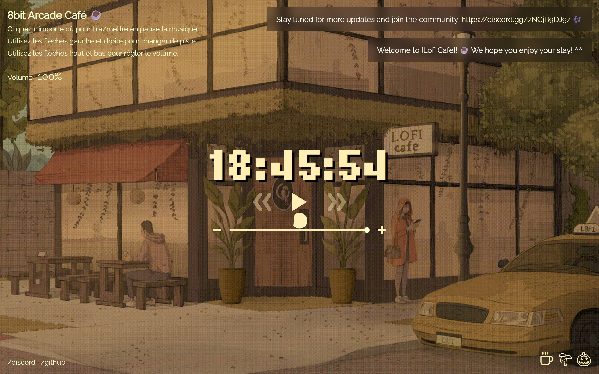
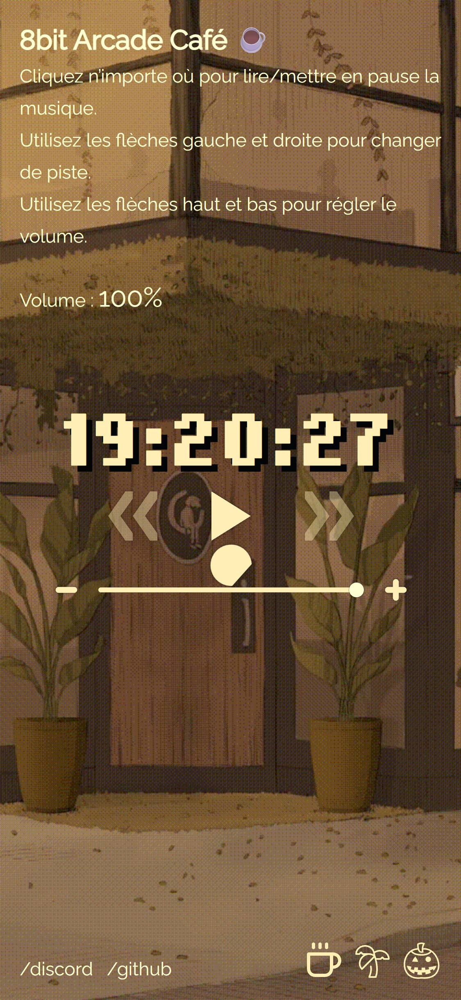
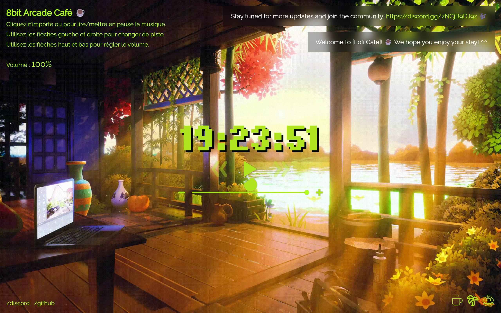

# Lofi Café – lecteur Lo‑Fi dans le navigateur

[](https://github.com/DEL-R/music_cafe/actions/workflows/static.yml)
[](https://github.com/DEL-R/music_cafe/releases)
[](https://del-r.github.io/music_cafe/)
[](LICENSE)
[](https://github.com/DEL-R/music_cafe/issues)

Un petit « café musical » statique : un fond animé, une horloge, un lecteur audio discret et un sélecteur de thèmes. Aucune installation ni backend — tout fonctionne dans votre navigateur.

## Sommaire

- [Lofi Café – lecteur Lo‑Fi dans le navigateur](#lofi-café--lecteur-lofi-dans-le-navigateur)
  - [Sommaire](#sommaire)
  - [Fonctionnalités clés](#fonctionnalités-clés)
  - [Structure du projet](#structure-du-projet)
  - [Démarrage rapide](#démarrage-rapide)
  - [Utilisation](#utilisation)
  - [Personnalisation](#personnalisation)
  - [Déploiement](#déploiement)
  - [Licence et droits](#licence-et-droits)
  - [Captures d’écran](#captures-décran)
  - [FAQ](#faq)
  - [Pour contributeurs](#pour-contributeurs)

## Fonctionnalités clés

- Lecture/pause au clic n’importe où dans la page
- Changement de piste avec les flèches gauche/droite (boutons UI inclus)
- Curseur de volume + affichage « Volume : 0–100% » (flèches haut/bas)
- Thèmes personnalisables (couleurs, police, image de fond) avec persistance (LocalStorage)
- Horloge en temps réel au centre de l’écran

## Structure du projet

- `index.html` — point d’entrée (inclut les feuilles de style et scripts)
- `css/` — styles (`index.css`, `player-controls.css`, `themer.css`, `hardpixel.css`)
- `js/` — logique applicative
  - `player-controller.js` (lecteur audio), `ui-controls.js` (interactions UI)
  - `themer.js` (application des thèmes), `preferences.js` (sauvegarde locale)
  - `utils.js` (helpers: heure, volume), `toast.js` (messages)
  - `data/songs.js` (liste d’URLs MP3), `data/themes.js` (définition des thèmes)
- `assets/` — images, fonds animés, polices

## Démarrage rapide

- Prérequis: un navigateur moderne. Recommandé: servir en local pour éviter les soucis CORS des fichiers audio distants.
- Lancer un serveur statique:
  - Python: `python -m http.server 5500` puis ouvrir `http://localhost:5500/`
  - Node: `npx serve .`

## Utilisation

- Clic n’importe où: lecture/pause
- Flèches gauche/droite: piste précédente/suivante
- Flèches haut/bas ou curseur: régler le volume (le pourcentage à gauche se met à jour)
- Sélecteur en bas à droite: changer de thème

## Personnalisation

- Ajouter un morceau: éditer `js/data/songs.js` et insérer une URL MP3 accessible (CORS permis, droit d’usage assuré).

```js
const song_list = [
  "https://exemple.com/mon-titre.mp3",
  // ...
];
```

- Ajouter un thème: éditer `js/data/themes.js` et ajouter via `createTheme(...)`. Placez le fond dans `assets/img/backgrounds/`.

```js
createTheme(
  "mon-theme",
  "<svg …></svg>",
  "#ffe0b3", "#fff7d1",
  "../assets/img/backgrounds/mon-fond.gif"
);
```

## Déploiement

- Projet 100% statique — idéal pour GitHub Pages, Netlify, Vercel Static.

## Licence et droits

- Code: voir `LICENSE`.
- Audio/Images: n’ajoutez que des ressources libres de droits ou sous licence compatible et accessibles en CORS.

## Captures d’écran







Pour régénérer les captures (optionnel):

- Démarrer un serveur: `python -m http.server 5500`
- Capturer: `npx -y capture-website-cli http://127.0.0.1:5500/ --output=docs/ui-desktop.jpg --width=1280 --height=800 --delay=2 --overwrite --type=jpeg --quality=0.72`

## FAQ

- La musique ne démarre pas automatiquement ? Les navigateurs bloquent l’autoplay: cliquez n’importe où dans la page pour lancer la lecture.
- Rien ne joue en ouvrant le fichier directement ? Servez le dossier via un petit serveur local pour éviter les erreurs CORS.
  - `python -m http.server 5500` puis ouvrez `http://localhost:5500/`
- Où sont stockées mes préférences (thème/volume) ? Dans le stockage local du navigateur (LocalStorage). Pour réinitialiser, effacez les données du site dans votre navigateur.
- Comment ajouter des morceaux ? Ajoutez des URLs MP3 dans `js/data/songs.js`. Utilisez des liens accessibles publiquement et autorisés (CORS/licence).
- Comment créer un thème ? Ajoutez une entrée via `createTheme(...)` dans `js/data/themes.js` et placez l’image de fond dans `assets/img/backgrounds/`.

## Pour contributeurs

- Guide de contribution: `AGENTS.md`
- Note interne (architecture et modules): `docs/NOTE_INTERNE.md`
  
